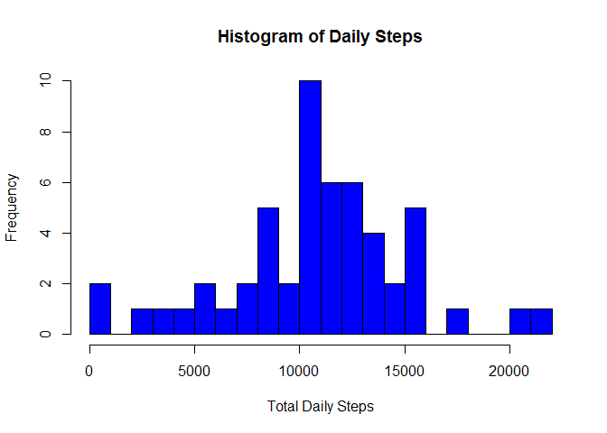
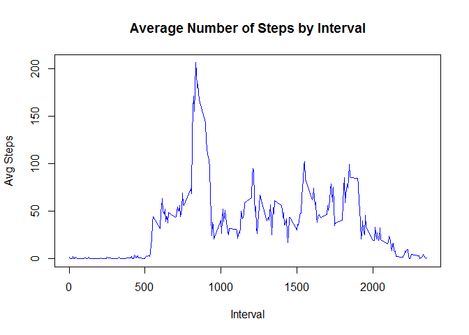
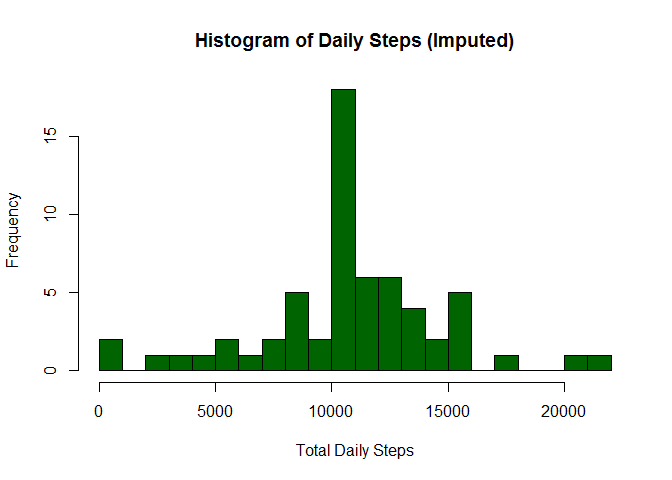
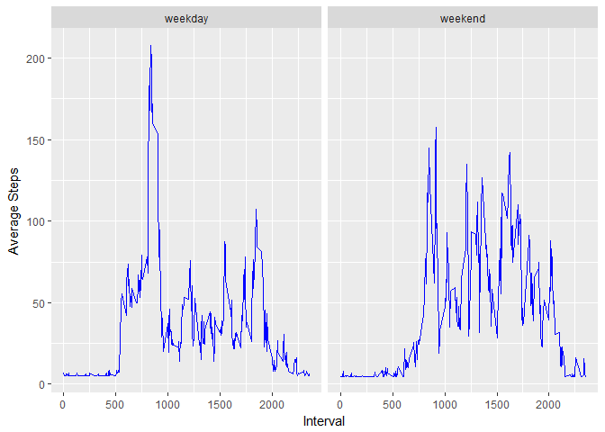

# Reproducible Research: Peer Assessment 1
### Peggy Lu
### November 20, 2016

## Initialization - load libraries, set working directory 


```r
library(knitr)
library(Hmisc)
```

```
## Loading required package: lattice
```

```
## Loading required package: survival
```

```
## Loading required package: Formula
```

```
## Loading required package: ggplot2
```

```
## 
## Attaching package: 'Hmisc'
```

```
## The following objects are masked from 'package:base':
## 
##     format.pval, round.POSIXt, trunc.POSIXt, units
```

```r
setwd('C:/Users/Lu/Documents/GitHub/RepData_PeerAssessment1')
```

## Loading and preprocessing the data

```r
#check to see if the csv file exists
if (!file.exists('activity.csv')){
#download the file from the source
    url <- "https://d396qusza40orc.cloudfront.net/repdata%2Fdata%2Factivity.zip"
    destfile <- "activity.zip"
    download.file(url, destfile)
    unzip('activity.zip')
}
df <- read.csv('activity.csv')
```

## What is mean total number of steps taken per day?
1.  Calculate the total number of steps taken per day 
2.  Make a histogram of the total number of steps taken each day
3.  Calculate and report the mean and median of the total number of steps taken per day


```r
DailyTotalSteps <- aggregate(steps ~ date, df, sum)
hist(DailyTotalSteps$steps, main = "Histogram of Daily Steps", xlab="Total Daily Steps", ylab="Frequency", col="blue", breaks=20)
```

<!-- -->

```r
#compute mean and median
DailyMeanSteps<-mean(DailyTotalSteps$steps, na.rm=TRUE)
DailyMedianSteps<-median(DailyTotalSteps$steps, na.rm=TRUE)
cat("The mean is ",  DailyMeanSteps, " and ", "the median is ",  DailyMedianSteps)
```

```
## The mean is  10766.19  and  the median is  10765
```

## What is the average daily activity pattern?
1.  Make a time series plot of the interval and the average number of steps taken, averaged across all days 
2.  Determine which 5-minute interval, on average across all the days in the dataset, contains the maximum number of steps

```r
IntervalSteps <- aggregate(steps ~ interval, df, mean)
plot(IntervalSteps$interval, IntervalSteps$steps, type="l", col="blue", main = "Average Number of Steps by Interval", xlab="Interval", ylab="Avg Steps")
```

<!-- -->

```r
#determine which 5-min interval contains the max number of steps 
IntervalSteps[which.max(IntervalSteps$steps),]
```

```
##     interval    steps
## 104      835 206.1698
```

## Imputing missing values
1.  Calculate and report the total number of missing values in the dataset  
2.  Devise a strategy for filling in all of the missing values in the dataset.  
3.  Create a new dataset that is equal to the original dataset but with the missing data filled in.
Make a histogram of the total number of steps taken each day and Calculate and report the mean and median total number of steps taken per day. 
4. What is the impact of imputing missing data on the estimates of the total daily number of steps?


```r
#total number of rows with NAs
sum(is.na(df$steps))
```

```
## [1] 2304
```

```r
imputed_df <- df
#filled the missing data with the mean of the original dataset 
imputed_df$steps <- impute(df$steps, mean) 
imputed_DailyTotalSteps<- aggregate(steps ~ date, imputed_df, sum)
hist(imputed_DailyTotalSteps$steps, main = "Histogram of Daily Steps (Imputed)", xlab="Total Daily Steps", ylab="Frequency", col="darkgreen", breaks=20)
```

<!-- -->

```r
#Original dataset
summary(DailyTotalSteps)
```

```
##          date        steps      
##  2012-10-02: 1   Min.   :   41  
##  2012-10-03: 1   1st Qu.: 8841  
##  2012-10-04: 1   Median :10765  
##  2012-10-05: 1   Mean   :10766  
##  2012-10-06: 1   3rd Qu.:13294  
##  2012-10-07: 1   Max.   :21194  
##  (Other)   :47
```

```r
#imputed dataset
summary(imputed_DailyTotalSteps)
```

```
##          date        steps      
##  2012-10-01: 1   Min.   :   41  
##  2012-10-02: 1   1st Qu.: 9819  
##  2012-10-03: 1   Median :10766  
##  2012-10-04: 1   Mean   :10766  
##  2012-10-05: 1   3rd Qu.:12811  
##  2012-10-06: 1   Max.   :21194  
##  (Other)   :55
```

The mean from the imputed dataset remains the same (when compared to the original dataset)  whle the median of the imputed dataset is slightly higher.

## Are there differences in activity patterns between weekdays and weekends?
1.  Create a new factor variable in the dataset with two levels - "weekday" and "weekend" 
2.  Make a panel plot containing a time series plot of the 5-minute interval (x-axis) and the average number of steps taken, averaged across all weekday days or weekend days (y-axis). .


```r
#set factor variable 
imputed_df$daytype<-ifelse (as.POSIXlt(imputed_df$date)$wday %in% c(0,6), 'weekend', 'weekday')
avg_df<-aggregate(steps ~ interval + daytype, imputed_df, mean)
ggplot(avg_df, aes(interval,steps)) + geom_line(color='blue') + facet_grid(. ~ daytype) + xlab("Interval") + ylab("Average Steps")
```

<!-- -->
